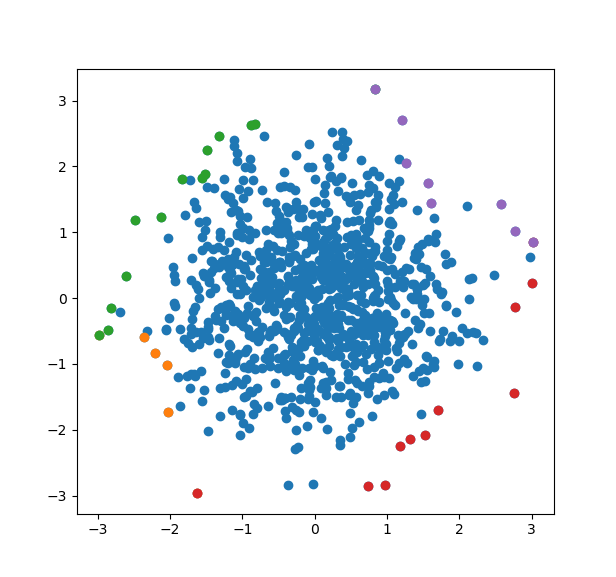

# ParetoFront

This tiny package determines a set of Pareto optimal vectors, also
known as maximal vectors, from a larger set of vectors. In database
area, this is also known as the "skyline operator".

Each vector is n dimensional and for each dimension we can choose
the optimality to be either min or max.  This is governed by two
vectors `min_idxs` and `max_idxs`. For an indice in `min_idxs` the
optimal value is considered to be a min and analogously for `max_idxs`.

Note that there is no error checking on the arrays `min_idxs` and
`max_idxs`. So an index cannot be in both `min_idxs` and `max_idxs`
and all indices in both must be legal indices of the input vector.

Here is an example of calculating all 4 different Pareto frontiers
in two dimensions.

    using ParetoFront
    using PyPlot
    
    pareto = [Set{Vector{Float64}}() for _ in 1:4]
    mins = [[1,2], [1], [2],    []]
    maxs = [   [], [2], [1], [1,2]]
    v = randn(1000, 2)
    for x in eachrow(v)
        for i in 1:4
            update_pareto!(pareto[i], x, mins[i], maxs[i])
        end
    end

    scatter(v[:,1], v[:,2])
    
    for i in 1:4
        front = Matrix(reduce(hcat, collect(pareto[i]))')
        scatter(front[:,1], front[:,2])
    end
    
And we can see the four different Pareto frontiers here

